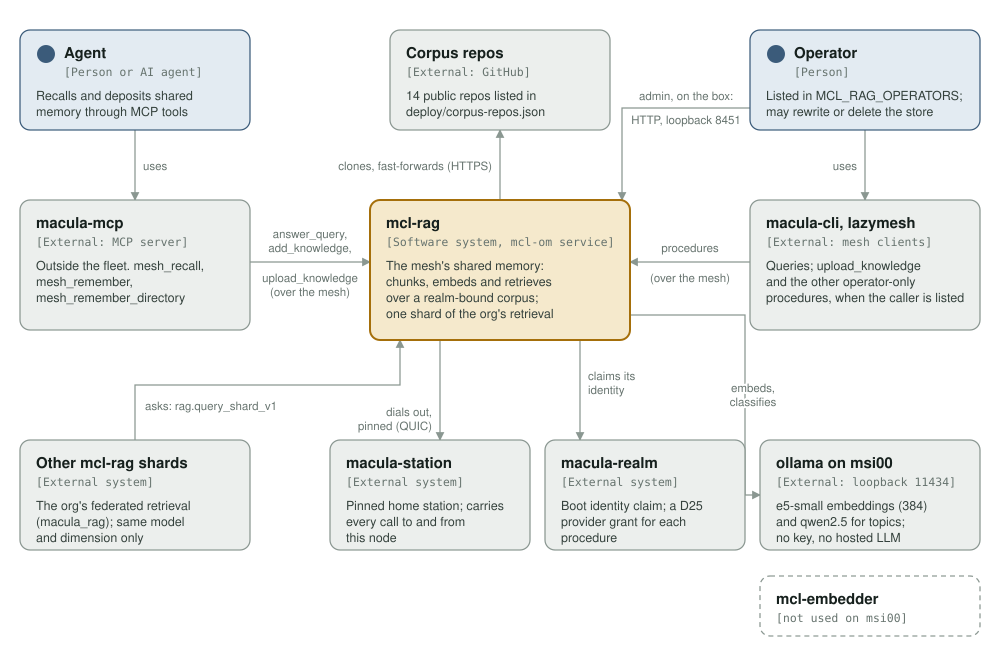
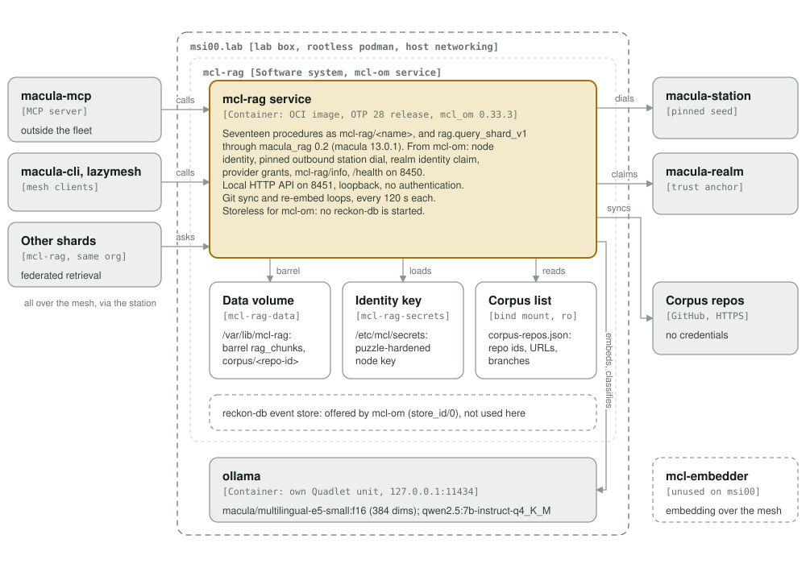
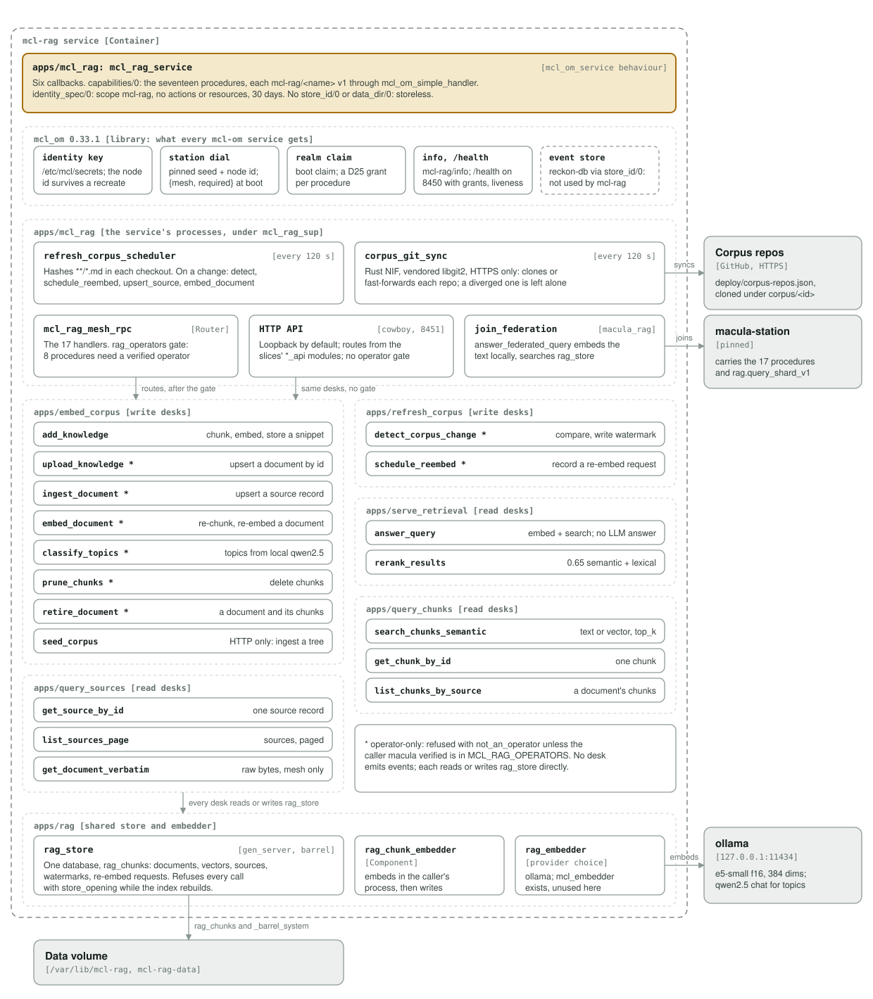

# mcl-rag architecture: C4 model

*This exists so an agent anywhere on the mesh can recall what the org already knows, and deposit what it learns, in one call.*

**Status: 2026-09-30, drawn from the 0.1.3 source** (mcl_om 0.33.3, macula 13.0.1, macula_rag 0.2). Everything here describes code that exists; the one thing marked *not used* is an alternative the code keeps but msi00 does not run.

`mcl-rag` holds the mesh's shared memory: documents from a set of git repos plus the knowledge agents deposit, chunked, embedded and searchable by meaning. It answers retrieval over it, and it is one shard of its org's federated retrieval. It is an `mcl-om` service: one OTP release in one OCI container, with its node identity, pinned outbound station dial, realm identity claim, provider grants, `mcl-rag/info` and `/health` coming from [`mcl-om`](https://github.com/macula-services/mcl-om).

Legend used in all three diagrams: the amber box is the element in scope, blue boxes are people, grey boxes are external, and dashed boxes are not used by this deployment: `mcl-embedder` (an embedding provider the code supports, not the one msi00 runs) and mcl-om's event store wiring (which mcl-rag does not take up).

## Level 1: system context

| Element | Role |
| --- | --- |
| mcl-rag | The shared memory: ingests, chunks and embeds; answers semantic retrieval; one shard of the org's federated retrieval |
| Agent | A person or an AI agent working through `macula-mcp`'s tools |
| macula-mcp | MCP server outside the fleet. `mesh_recall` calls `mcl-rag/answer_query`, `mesh_remember` calls `mcl-rag/add_knowledge`, `mesh_remember_directory` calls `mcl-rag/upload_knowledge` once per file |
| macula-cli, macula-lazymesh | Mesh clients. Any caller may query; the operator-only procedures work only for a listed operator |
| Operator | A node id in `MCL_RAG_OPERATORS`, allowed to rewrite or delete what the store holds. On the box itself, also the only user of the loopback HTTP API |
| Corpus repos | The public GitHub repos in `deploy/corpus-repos.json` (14 today), cloned over HTTPS, no credentials, and held at the commit each entry pins |
| Other mcl-rag shards | The org's federated retrieval (`macula_rag`): a peer asks this shard with `mcl-rag/rag.query_shard_v1`. Scores merge only between shards naming the same model and dimension |
| macula-station | The pinned home station the service dials out to over QUIC; every call to and from this node goes through it |
| macula-realm | Takes the boot identity claim and grants a D25 provider authorization for each procedure; its public key (`MCL_REALM_KEY`) is the trust anchor for every advertisement |
| ollama on msi00 | The node's own model server on loopback `127.0.0.1:11434`: embeddings and the topic classifier. No API key, no hosted LLM, nothing leaves the box |
| mcl-embedder | Embedding over the mesh (`mcl-embedder/embed`), for a node that cannot embed locally. Supported by the code (`embed_provider mcl_embedder`), not used on msi00 |

**Retrieval, not generation.** `answer_query` embeds the query text and returns the nearest chunks with their scores. No language model writes an answer. The only chat model in the service is the topic classifier, and it only labels chunks.

**Mesh calls are authenticated, not sealed.** macula verifies each caller's node id on the wire, and the operator gate reads that verified id. The service advertises no KEM key, so its calls are not sealed end to end.

## Level 2: containers

| Container | Technology | Responsibility |
| --- | --- | --- |
| mcl-rag service | OCI image (`ghcr.io/macula-services/mcl-rag`, deployed by digest), OTP 28.4.3 release, `mcl_om_service` behaviour | Seventeen procedures as `mcl-rag/<name>` v1, `mcl-rag/rag.query_shard_v1` through macula_rag, the corpus sync and re-embed loops. Health on 8450, local HTTP API on 8451 (loopback) |
| Data volume | Named volume `mcl-rag-data` at `/var/lib/mcl-rag` | One barrel database, `rag_chunks` (documents, and vectors under `vectors/`), barrel_docdb's `_barrel_system`, and the corpus checkouts under `corpus/<repo-id>`. Removing it wipes the memory and the node re-embeds the whole corpus |
| Identity key | Named volume `mcl-rag-secrets` at `/etc/mcl/secrets` | The puzzle-hardened node key mcl-om generates on first boot; the node id survives a container recreate |
| Corpus list | `deploy/corpus-repos.json`, bind-mounted read-only at `/etc/mcl-rag/corpus-repos.json` | Which repos to sync, each at a pinned 40-hex `commit` on its `branch`; an entry without one is refused. Each id is the watermark namespace, so renaming one re-embeds that repo |
| ollama | Its own Quadlet unit on msi00, `127.0.0.1:11434` | `macula/multilingual-e5-small:f16` (built on msi00 from intfloat's weights), 384 dimensions, for every stored vector (as `passage: ` text) and every query (as `query: ` text); `qwen2.5:7b-instruct-q4_K_M` through the OpenAI-compatible endpoint for topics |

**Placement.** The service runs on msi00, a lab box, with host networking: macula stations are reachable over IPv6 and a default bridge has none. The service's own compose file (`deploy/docker-compose.yml`) carries what the service knows about itself; placement (which box, station, realm, secrets) belongs to macula-fleet.

**What mcl-om gives it, and what it leaves.** From mcl-om: the node key on the identity volume, the pinned station dial (`MACULA_STATION_SEEDS` paired index for index with `MACULA_STATION_NODE_IDS`; with `{mesh, required}` a boot missing the realm, its key or the pinned stations stops and names each one), the boot identity claim with `MCL_SERVICE_NAME` and `MCL_BOX` labels, capability adverts gated on the realm's D25 grants, `mcl-rag/info`, and `/health`. mcl-om would also start a reckon-db event store for a service that exports `store_id/0` and `data_dir/0`; mcl-rag exports neither, so no event store runs. Its state is the barrel database.

**Startup.** Opening the store rebuilds the vector index, several minutes on the full corpus. Meanwhile `/health` reports `degraded, store_opening` and every call is refused with `{error, store_opening}`; the image's health check has a 900 s start period to cover it.

## Level 3: components of the service

| Component | Kind | Responsibility |
| --- | --- | --- |
| `mcl_rag_service` | `mcl_om_service` module | Six callbacks. `capabilities/0` lists the seventeen procedures, each through `mcl_om_simple_handler` into `mcl_rag_mesh_rpc`. `identity_spec/0` claims scope `mcl-rag`, no actions or resources, 30 days. `health/0`: the store first, then the federation join. `start/1` refuses a malformed operator list |
| `mcl_rag_mesh_rpc` | Router (`apps/mcl_rag`) | One handler per procedure. Every call passes `rag_operators` first, then the desk; replies are shaped for the wire (text, not bytes) |
| `rag_operators` | Gate (`apps/mcl_rag`) | Eight procedures are operator-only: `prune_chunks`, `retire_document`, `ingest_document`, `upload_knowledge`, `embed_document`, `classify_topics`, `schedule_reembed`, `detect_corpus_change`. The caller is the node id macula verified on the wire, never a field the caller wrote. Anyone else gets `not_an_operator`; an empty list means nobody |
| HTTP API | cowboy listener (`apps/mcl_rag`) | Port 8451 on loopback by default. Routes are collected from the slices' `*_api` modules. It has writes and no authentication, and does not apply the operator gate, which is why it stays on loopback. Adds `/api/rag/seed`; has no `get_document_verbatim` |
| `join_federation`, `answer_federated_query` | macula_rag shard (`apps/mcl_rag`) | Configures macula_rag with the org, the realm name and the embedding (model, dimension), registers the responder and publishes the shard summary. A shard query is embedded locally and searched in `rag_store` |
| `corpus_git_sync` | gen_server + Rust NIF `mcl_rag_corpus_sync_nif` | Every 120 s, re-reads the corpus list and clones or fast-forwards each repo (vendored libgit2, HTTPS only, no OS `git`). A diverged checkout is reported and left alone |
| `refresh_corpus_scheduler` | gen_server (`apps/mcl_rag`) | Every 120 s, hashes each `**/*.md` in every checkout; on a change it calls `detect_corpus_change`, `schedule_reembed`, `rag_store:upsert_source/1` and `embed_document`. A failed refresh is retried on the next tick |
| `add_knowledge/`, `upload_knowledge/`, `ingest_document/`, `embed_document/`, `classify_topics/`, `prune_chunks/`, `retire_document/`, `seed_corpus/` | Write desks (`apps/embed_corpus`) | Chunk, embed and store; upsert, re-embed, label or delete. `classify_topics` asks the local qwen2.5 through `rag_topic_classifier`. `seed_corpus` is HTTP only |
| `detect_corpus_change/`, `schedule_reembed/` | Write desks (`apps/refresh_corpus`) | Compare a file's hash with its watermark and record a change; record a re-embed request |
| `answer_query/`, `rerank_results/` | Read desks (`apps/serve_retrieval`) | `answer_query` is `search_chunks_semantic`. `rerank_results` blends the semantic score (0.65) with lexical overlap; no reranking model |
| `search_chunks_semantic/`, `get_chunk_by_id/`, `list_chunks_by_source/` | Read desks (`apps/query_chunks`) | Search by text (embedded as a query) or by a vector the caller made the same way, with `top_k` and optional topic filter; one chunk; a document's chunks |
| `get_source_by_id/`, `list_sources_page/`, `get_document_verbatim/` | Read desks (`apps/query_sources`) | One source record; sources paged; a document's raw bytes (mesh only) |
| `rag_store` | gen_server over barrel (`apps/rag`) | The one database, `rag_chunks`: chunk content, metadata and vectors, source records, watermarks and re-embed requests. Barrel never embeds by itself; callers pass the vector in |
| `rag_embedder`, `rag_chunk_embedder` | Components (`apps/rag`) | `rag_embedder` decides the provider in one place, so stored vectors and queries always come from the same model: `ollama` on loopback (msi00) or `mcl_embedder` over the mesh. `rag_chunk_embedder` embeds in the caller's process, then writes, so the store's process never waits on the model |

**No events.** The desks keep the command, handler and desk-per-capability shape, but none emits a domain event: every write goes straight to `rag_store`. A few command modules carry the `evoq_command` behaviour for their `from_map`/`validate` shape; nothing dispatches them through evoq, and no event store runs. So `embed_corpus`, `refresh_corpus` and `serve_retrieval` list `evoq` and not `reckon_db` or `reckon_evoq`; a test holds every app to listing only what its modules use.

## Open questions

- [ ] macula-fleet `origin/main` (19e27d8, 2026-09-29) declares msi00's `ollama.container` but no mcl-rag unit yet, and records msi00 as installed by `edge/msi00.lab/apply-quadlets.sh` rather than reconciled. Which file carries mcl-rag's placement, and which station does it pin?

## Editing the diagrams

The SVGs in [`../assets/`](../assets/) are self-contained and all three are generated by [`c4_diagrams.py`](c4_diagrams.py) (run it from the repository root: `python3 architecture/c4_diagrams.py`). Colours are plain classes with a `prefers-color-scheme: dark` block, so they render the same on GitHub, in IDE previews and through `rsvg-convert`. CSS custom properties are avoided on purpose: `rsvg-convert` renders them black. Keep this file's tables in step with the diagrams.
